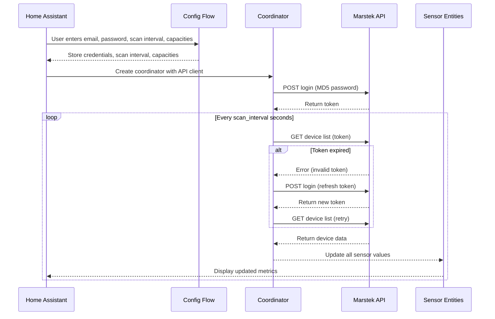

# Marstek Cloud Battery – Home Assistant Custom Integration

[](https://github.com/custom-components/hacs)
[](https://github.com/d0n0van/marstek_cloud/releases)
[](https://github.com/d0n0van/marstek_cloud)

> **📝 Fork Notice**: This is a fork of the original [Marstek Cloud integration](https://github.com/DoctaShizzle/marstek_cloud) by [@DoctaShizzle](https://github.com/DoctaShizzle). All original work and credits go to the original developer. This fork adds HACS support, Energy Dashboard integration, API optimizations, and production-ready enhancements.

This custom integration connects your Marstek battery system (via the Marstek cloud API) to Home Assistant, pulling live data and exposing it as sensor entities.

---

## ✨ Features

- **Automatic login & token refresh**  
  Logs in to the Marstek cloud API using your credentials, hashes your password (MD5) before sending, and automatically refreshes the token if it expires.
  
- **Configurable scan interval**  
  Set how often the integration polls the API (10–3600 seconds) during initial setup or later via the Options menu.

- **Battery metrics exposed as sensors**  
  - `soc` – State of charge (%)
  - `charge` – Charge power (W)
  - `discharge` – Discharge power (W)
  - `charge_kwh` – Charge power (kWh) with `state_class: total` and `device_class: energy`
  - `discharge_kwh` – Discharge power (kWh) with `state_class: total` and `device_class: energy`
  - `load` – Load power (W)
  - `profit` – Profit (€)
  - `version` – Firmware version
  - `sn` – Serial number
  - `report_time` – Timestamp of last report
  - `total_charge` – Total charge per device (kWh).

- **Cross-device total charge sensor**  
  - `total_charge_all_devices` – Sum of total charges across all batteries (kWh).

- **Diagnostic sensors**  
  - `last_update` – Time of last successful update
  - `api_latency` – API call duration in milliseconds
  - `connection_status` – Online/offline status

- **Device registry integration**  
  Each battery appears as a device in HA with model, serial number, firmware version, and manufacturer.

- **Editable battery capacity**  
  Configure the default capacity (in kWh) for each battery during setup or later via the Options menu.

---

## 🛠 Installation

### Option 1: HACS (Recommended)

1. Install [HACS](https://hacs.xyz/) if you haven't already
2. In HACS, go to **Integrations**
3. Click the three dots menu (⋮) and select **Custom repositories**
4. Add this repository: `https://github.com/d0n0van/marstek_cloud`
5. Select **Integration** as the category
6. Click **Add** and then **Install**
7. Restart Home Assistant
8. Go to **Settings → Devices & Services → Add Integration** and search for **Marstek Cloud Battery**

### Option 2: Manual Installation

1. Download the latest release from [GitHub](https://github.com/d0n0van/marstek_cloud/releases)
2. Extract the `marstek_cloud` folder into your Home Assistant `custom_components` directory
3. Restart Home Assistant
4. Go to **Settings → Devices & Services → Add Integration** and search for **Marstek Cloud Battery**

### Configuration

Enter your Marstek cloud email, password, and desired scan interval during setup.

---

## ⚙️ Configuration Options

- **Scan Interval**: Set during initial setup and changeable later via the integration's **Configure** option
  - Minimum: 10 seconds
  - Maximum: 3600 seconds (1 hour)
  - Default: 60 seconds
  
- **Default Battery Capacity**: Set for each battery during setup or via the **Options** menu
  - Default: 5.12 kWh
  - Configurable per device

- **Per-Device Capacity**: Edit individual battery capacities via the **Options** menu after setup

---

## 🧪 Development & Testing

This project uses **Conda** for environment management and includes comprehensive tests to ensure reliability and functionality.

### Development Environment Setup

#### Quick Start with Conda

We provide an automated setup script that handles everything for you:

```bash
# Activate the development environment (creates it if needed)
source activate_env.sh

# The script will:
# - Automatically detect and set up conda
# - Create the 'marstek_cloud' conda environment (if needed)
# - Install all required dependencies
# - Show environment information
```

#### Manual Setup

If you prefer manual setup:

```bash
# Create conda environment
conda create -n marstek_cloud python=3.11 -y
conda activate marstek_cloud

# Install dependencies
pip install -r requirements.txt
pip install -r requirements-dev.txt
```

### Running Tests

```bash
# Activate environment first (if not already active)
conda activate marstek_cloud

# Run all unit tests (fast, no API calls)
python run_tests.py

# Run unit tests only (with pytest directly)
python -m pytest tests/test_coordinator.py -v

# Run integration tests (requires real API credentials)
python run_integration_test.py

# Run all tests with coverage
pytest --cov=marstek_cloud --cov-report=html
```

#### Testing Against Real API

To test against the real Marstek Cloud API:

1. Create a `.env` file with your credentials:
   ```bash
   cp env.example .env
   # Edit .env with your real credentials:
   # MARSTEK_EMAIL=your_email@example.com
   # MARSTEK_PASSWORD=your_password
   ```

2. Run integration tests:
   ```bash
   python run_integration_test.py
   ```

The integration tests will:
- Test real API authentication
- Fetch actual device data
- Test performance and error handling
- Validate data structure from real API
- Test connection robustness and rate limiting

### Development Workflow

```bash
# Format code
black .

# Lint code
flake8 .

# Type checking
mypy .

# Run pre-commit hooks
pre-commit run --all-files
```

---

## ⚡ Energy Dashboard Integration

The integration now provides **native Energy Dashboard support** with dedicated kWh sensors that have the correct `state_class: total` and `device_class: energy` attributes.

### Option 1: Use Native kWh Sensors (Recommended)

The integration automatically creates these sensors for each device:
- `sensor.{device_name}_charge_power_kwh` – Charge power in kWh
- `sensor.{device_name}_discharge_power_kwh` – Discharge power in kWh

To use them in the Energy Dashboard:
1. Go to **Settings → Energy**
2. Add the `charge_power_kwh` and `discharge_power_kwh` sensors to your battery configuration

### Option 2: Custom Template Sensors

If you prefer custom names, you can still use template sensors:

```yaml
template:
  - sensor:
      - name: "Marstek charge"
        unit_of_measurement: "kWh"
        unique_id: venus_charge_power
        state: "{{ (states('sensor.mst_vnse3_a4c2_charge_power') | float(0) / 1000) | round(2) }}"
        state_class: total
        device_class: energy
  - sensor:
      - name: "Marstek discharge"
        unit_of_measurement: "kWh"
        unique_id: venus_discharge_power
        state: "{{ (states('sensor.mst_vnse3_a4c2_discharge_power') | float(0) / 1000) | round(2) }}"
        state_class: total
        device_class: energy
```

**Note**: Replace `mst_vnse3_a4c2` with your actual device name from the Marstek Cloud integration. You can find the exact sensor names in **Settings → Devices & Services → Entities**.

---

## 🔍 Logic Flow

Here’s how the integration works internally:

### 1. **Setup**
- `config_flow.py` collects your email, password, scan interval, and default battery capacities.
- These are stored securely in HA’s config entries.

### 2. **Coordinator & API**
- `__init__.py` creates:
  - An `aiohttp` session for async HTTP calls.
  - A `MarstekAPI` instance for talking to the cloud API.
  - A `MarstekCoordinator` (subclass of `DataUpdateCoordinator`) that schedules periodic updates.

### 3. **Login & Token Handling**
- On first run, `MarstekAPI._get_token()`:
  - MD5‑hashes your password.
  - Sends a POST request to `https://eu.hamedata.com/app/Solar/v2_get_device.php`.
  - Stores the returned `token`.
- On each update, `MarstekAPI.get_devices()`:
  - Calls `https://eu.hamedata.com/ems/api/v1/getDeviceList` with the token.
  - If the API responds with an invalid/expired token, it refreshes and retries once.
  - If the API responds with error code `8` (no access permission), it clears the cached token and logs the error. A new token will be obtained automatically on the next update cycle.

### 4. **Data Fetching**
- The coordinator’s `_async_update_data()`:
  - Records the start time.
  - Calls `api.get_devices()` to fetch the latest battery list.
  - Calculates API latency in milliseconds.
  - Returns the list of devices to all entities.

### 5. **Entity Creation**
- `sensor.py`:  
  - For each device in the API response, creates:  
    - One `MarstekSensor` per metric in `SENSOR_TYPES`.  
    - One `MarstekDiagnosticSensor` per metric in `DIAGNOSTIC_SENSORS`.  
    - One `MarstekDeviceTotalChargeSensor` for the total charge per device.  
  - Creates a `MarstekTotalChargeSensor` for the cross-device total charge.  
  - Each entity has:  
    - A unique ID (`devid_fieldname`).  
    - Device info (name, model, serial, firmware, manufacturer).

### 6. **Updates**
- HA calls `async_update()` on entities when needed.
- Entities pull their latest value from the coordinator’s cached data.
- The coordinator refreshes data on the configured interval or when manually triggered.

---

## 📡 API Endpoints Used

- **Login**:  
  `POST https://eu.hamedata.com/app/Solar/v2_get_device.php?pwd=<MD5_PASSWORD>&mailbox=<EMAIL>`

- **Get Devices**:  
  `GET https://eu.hamedata.com/ems/api/v1/getDeviceList?token=<TOKEN>`

---

## 📊 Sequence Diagram



---

## 🙏 Credits & Acknowledgments

### Original Developer
- **[@DoctaShizzle](https://github.com/DoctaShizzle)** - Original Marstek Cloud integration
- **Repository**: [https://github.com/DoctaShizzle/marstek_cloud](https://github.com/DoctaShizzle/marstek_cloud)
- **Original Work**: All core integration logic, API communication, and sensor implementation

### Fork Enhancements
This fork builds upon the original work with the following additions:
- **HACS Support**: Repository structure and configuration for easy installation
- **Energy Dashboard Integration**: Native kWh sensors with proper state_class and device_class
- **API Optimizations**: Smart caching, adaptive intervals, and reduced API calls
- **Production Readiness**: Comprehensive testing, error handling, and documentation
- **Code Quality**: Type hints, linting, pre-commit hooks, and CI/CD setup
- **Conda Integration**: Automated development environment setup with conda
- **Comprehensive Test Suite**: Unit and integration tests with proper mocking

### Development Tools
This project is developed using modern AI-assisted development tools:
- **[Cursor AI](https://cursor.sh/)**: Heavily used for AI-assisted code generation, refactoring, and debugging
- **Conda**: For reliable environment and dependency management
- **Pytest**: For comprehensive testing framework
- **Black & Flake8**: For code formatting and linting
- **mypy**: For static type checking

### License
This project maintains the same license as the original repository. Please refer to the original repository for licensing information.

---

## 📞 Support & Issues

- **Original Issues**: [@DoctaShizzle/marstek_cloud/issues](https://github.com/DoctaShizzle/marstek_cloud/issues)
- **Fork Issues**: [@d0n0van/marstek_cloud/issues](https://github.com/d0n0van/marstek_cloud/issues)
- **HACS Support**: [HACS Discord](https://discord.gg/5a5J7UK)
- **Home Assistant Community**: [Community Forum](https://community.home-assistant.io/)
